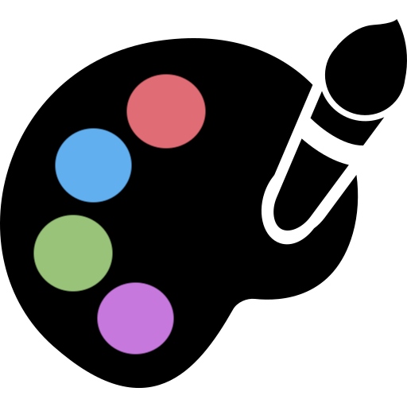
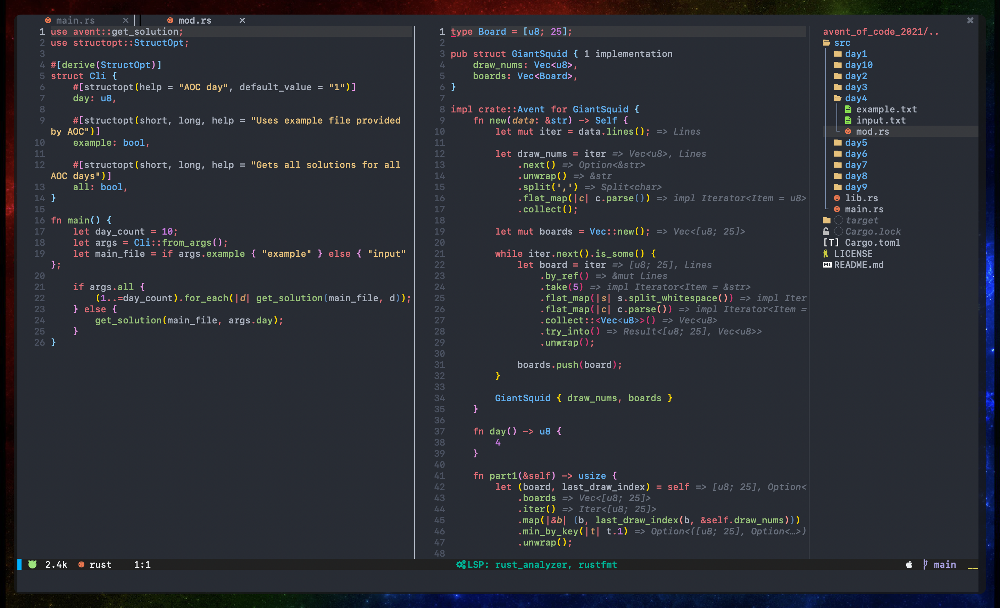
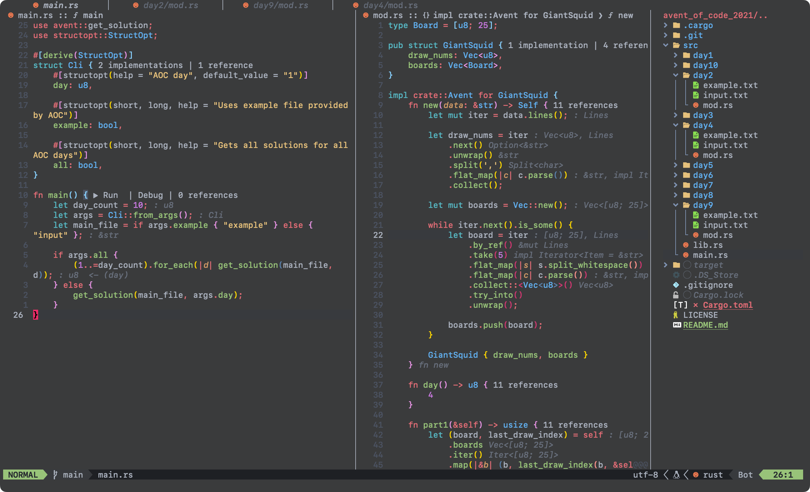

<div align="center">
  <h1>
      
      <br/>
      One Monokai Nvim
  </h1>
  
  VSCode One Monokai theme written in Lua for Neovim.
</div>




<!--toc:start-->

- [🚀 Installation](#-installation)
  - [Requirement](#requirement)
- [⚙️ Setup](#%EF%B8%8F-setup)
  - [Options](#options)
    - [Default](#default)
  - [Customization example](#customization-example)
- [🍾 Plugins support](#-plugins-support)
- [👀 Inspiration](#-inspiration)
<!--toc:end-->

## 🚀 Installation

```lua
use "cpea2506/one_monokai.nvim"
```

### Requirement

- Neovim version >= 0.7
- (Optional) [Nvim Treesitter](https://github.com/nvim-treesitter/nvim-treesitter) for better syntax highlighting. 😇

## ⚙️ Setup

```lua
vim.cmd("colorscheme one_monokai")
```

Or prefer below if you have your custom options

```lua
require("one_monokai").setup({
    use_cmd = true
    --... other options
})
```

### Options

| Option        | Description                            | Type       | Note                         |
| ------------- | -------------------------------------- | ---------- | ---------------------------- |
| `use_cmd`     | automatically set colorscheme on setup | `boolean`  | N/A                          |
| `transparent` | enable transparent background          | `boolean`  | N/A                          |
| `colors`      | custom colors                          | `table`    | N/A                          |
| `themes`      | custom highlighting groups             | `function` | accepts `colors` as argument |

#### Default

```lua
{
    use_cmd = false,
    transparent = false,
    colors = {},
    themes = function(colors)
        return {}
    end,
}
```

### Customization example

You can easily change highlighting groups. Override the list of supported values or add more on your own.

1. [Colors](lua/one_monokai/colors.lua#L5)
2. [Themes](lua/one_monokai/themes/groups.lua#L8)

```lua
require("one_monokai").setup({
    use_cmd = true,
    colors = {
        green = "#00ff00",
        blue = "#0000ff",
        roman = "#e36965",
        lmao = "#282c34",
    },
    themes = function(colors)
        return {
            Normal = { bg = colors.lmao },
            Comment = { fg = colors.pink, italic = true },
            ErrorMsg = { fg = "black", bg = "#ec6075", standout = true },
            NormalFloat = { link = "Normal" },
        }
    end,
})
```

## 🍾 Plugins support

- [Treesitter](https://github.com/nvim-treesitter/nvim-treesitter)
- [LspConfig](https://github.com/neovim/nvim-lspconfig)
- [Telescope](https://github.com/nvim-telescope/telescope.nvim)
- [Nvim Semantic Token](https://github.com/theHamsta/nvim-semantic-tokens)
- [Mason](https://github.com/williamboman/mason.nvim)
- [Dashboard](https://github.com/glepnir/dashboard-nvim)
- [Nvimtree](https://github.com/kyazdani42/nvim-tree.lua)
- [WhichKey](https://github.com/folke/which-key.nvim)
- [Cmp](https://github.com/hrsh7th/nvim-cmp)
- [NvimNavic](https://github.com/SmiteshP/nvim-navic)
- [Illuminate](https://github.com/RRethy/vim-illuminate)
- [Leap](https://github.com/ggandor/leap.nvim)
- [Indent Blankline](https://github.com/lukas-reineke/indent-blankline.nvim)
- [Crates](https://github.com/Saecki/crates.nvim)
- [Notify](https://github.com/rcarriga/nvim-notify)
- [Bufferline](https://github.com/akinsho/bufferline.nvim)
- [Lualine](https://github.com/nvim-lualine/lualine.nvim)

  

  ```lua
  require("lualine").setup {
        options = {
        -- ...other options
        theme = "one_monokai"
      }
  }
  ```

## 👀 Inspiration

This is the best theme I’ve ever seen in my eyes. I’ve tried it written in Vim for a long time and decided to write it in Lua for compatibility with Neovim, make it easy to change some settings.

Thanks for these talented and amazing people:

- [one-monokai-vim](https://github.com/fratajczak/one-monokai-vim)
- [vscode one-monokai](https://github.com/azemoh/vscode-one-monokai)
- [tokyonight](https://github.com/folke/tokyonight.nvim)
- [onedarkpro](https://github.com/olimorris/onedarkpro.nvim)
